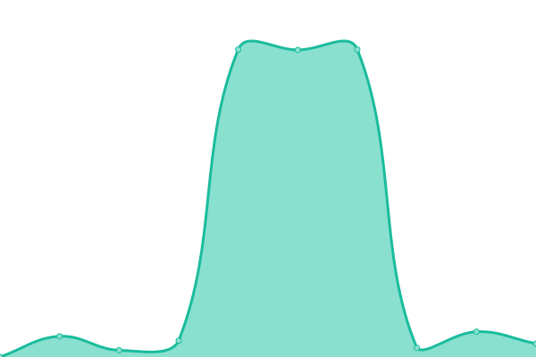
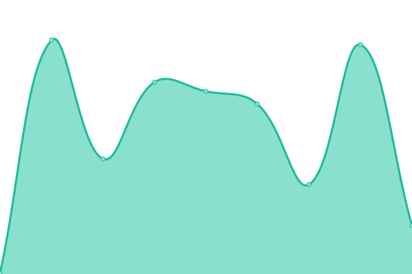
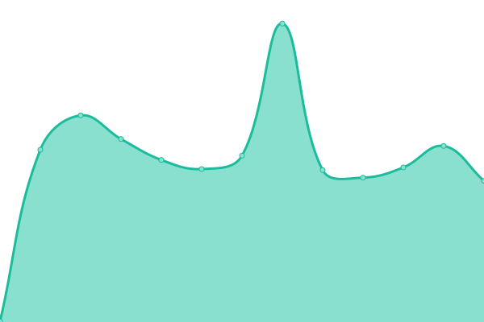

# [📈 Live Status](https://status.starlightgaming.network/): <!--live status--> **🟩 All systems operational**

This repository contains the open-source uptime monitor and status page for [Starlight Community Network](https://starlightgaming.network), powered by [Upptime](https://github.com/upptime/upptime).

With [Upptime](https://upptime.js.org), you can get your own unlimited and free uptime monitor and status page, powered entirely by a GitHub repository. We use [Issues](https://github.com/Starlight-Community-Network/Status.starlightgaming.network/issues) as incident reports, [Actions](https://github.com/Starlight-Community-Network/Status.starlightgaming.network/actions) as uptime monitors, and [Pages](https://https://status.starlightgaming.network/) for the status page.

<!--start: status pages-->
<!-- This summary is generated by Upptime (https://github.com/upptime/upptime) -->
<!-- Do not edit this manually, your changes will be overwritten -->
<!-- prettier-ignore -->
| URL | Status | History | Response Time | Uptime |
| --- | ------ | ------- | ------------- | ------ |
|  [Starlight Community Network](https://www.starlightgaming.network) | 🟩 Up | [starlight-community-network.yml](https://github.com/Starlight-Community-Network/Status.starlightgaming.network/commits/HEAD/history/starlight-community-network.yml) | 

 772ms
     
 | 

<a href="https://status.starlightgaming.network/history/starlight-community-network">82.54%</a>
    

|  [Fallback Site](https://fallback.starlightgaming.network) | 🟩 Up | [fallback-site.yml](https://github.com/Starlight-Community-Network/Status.starlightgaming.network/commits/HEAD/history/fallback-site.yml) | 

 124ms
     
 | 

<a href="https://status.starlightgaming.network/history/fallback-site">100.00%</a>
    

|  [Classic Site](https://classic.starlightgaming.network) | 🟩 Up | [classic-site.yml](https://github.com/Starlight-Community-Network/Status.starlightgaming.network/commits/HEAD/history/classic-site.yml) | 

 348ms
     
 | 

<a href="https://status.starlightgaming.network/history/classic-site">100.00%</a>
    

|  [Photon Tweaks](https://photontweaks.starlightgaming.network/) | 🟩 Up | [photon-tweaks.yml](https://github.com/Starlight-Community-Network/Status.starlightgaming.network/commits/HEAD/history/photon-tweaks.yml) | 

 347ms
     
 | 

<a href="https://status.starlightgaming.network/history/photon-tweaks">100.00%</a>
    

|  [Roguenight Transportation CAD](https://rntcad.starlightgaming.network/) | 🟩 Up | [roguenight-transportation-cad.yml](https://github.com/Starlight-Community-Network/Status.starlightgaming.network/commits/HEAD/history/roguenight-transportation-cad.yml) | 

 612ms
     
 | 

<a href="https://status.starlightgaming.network/history/roguenight-transportation-cad">100.00%</a>
    

|  [Blossom Rabbit lounge](https://Blossom.starlightgaming.network) | 🟩 Up | [blossom-rabbit-lounge.yml](https://github.com/Starlight-Community-Network/Status.starlightgaming.network/commits/HEAD/history/blossom-rabbit-lounge.yml) | 

 320ms
     
 | 

<a href="https://status.starlightgaming.network/history/blossom-rabbit-lounge">100.00%</a>
    

|  [BRCRP CAD](https://brcrpcad.hamz.pro/) | 🟩 Up | [brcrp-cad.yml](https://github.com/Starlight-Community-Network/Status.starlightgaming.network/commits/HEAD/history/brcrp-cad.yml) | 

 2168ms
     
 | 

<a href="https://status.starlightgaming.network/history/brcrp-cad">100.00%</a>
    

|  [BRCRP Server](http://brcrp.starlightgaming.net:3009) | 🟩 Up | [brcrp-server.yml](https://github.com/Starlight-Community-Network/Status.starlightgaming.network/commits/HEAD/history/brcrp-server.yml) | 

 923ms
     
 | 

<a href="https://status.starlightgaming.network/history/brcrp-server">99.34%</a>
    

|  [BRCRP Admin Panel](http://brcrp.starlightgaming.net:3027) | 🟩 Up | [brcrp-admin-panel.yml](https://github.com/Starlight-Community-Network/Status.starlightgaming.network/commits/HEAD/history/brcrp-admin-panel.yml) | 

 159ms
     
 | 

<a href="https://status.starlightgaming.network/history/brcrp-admin-panel">99.35%</a>
    

|  [FluffyxGaming](https://fluffyx.starlightgaming.network/) | 🟩 Up | [fluffyx-gaming.yml](https://github.com/Starlight-Community-Network/Status.starlightgaming.network/commits/HEAD/history/fluffyx-gaming.yml) | 

 328ms
     
 | 

<a href="https://status.starlightgaming.network/history/fluffyx-gaming">100.00%</a>
    

|  [Collin3DModels](https://www.collin3dmodels.com/) | 🟩 Up | [collin3-d-models.yml](https://github.com/Starlight-Community-Network/Status.starlightgaming.network/commits/HEAD/history/collin3-d-models.yml) | 

 361ms
     
 | 

<a href="https://status.starlightgaming.network/history/collin3-d-models">100.00%</a>
    

<!--end: status pages-->

[**Visit our status website →**](https://status.starlightgaming.network/)

## 📄 License

- Powered by: [Upptime](https://github.com/upptime/upptime)
- Code: [MIT](./LICENSE) © [Anand Chowdhary](https://anandchowdhary.com), supported by [Pabio](https://pabio.com)
- Data in the `./history` directory: [Open Database License](https://opendatacommons.org/licenses/odbl/1-0/)
