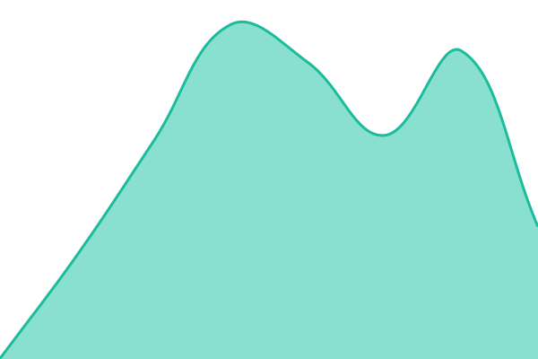
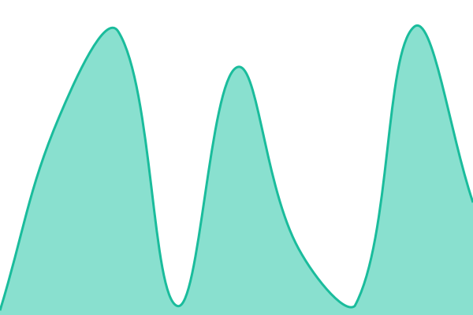

# [📈 Live Status](https://status.starlightgaming.network/): <!--live status--> **🟧 Partial outage**

This repository contains the open-source uptime monitor and status page for [Starlight Community Network](https://starlightcommunity.network), powered by [Upptime](https://github.com/upptime/upptime).

With [Upptime](https://upptime.js.org), you can get your own unlimited and free uptime monitor and status page, powered entirely by a GitHub repository. We use [Issues](https://github.com/Starlight-Community-Network/Status.starlightgaming.network/issues) as incident reports, [Actions](https://github.com/Starlight-Community-Network/Status.starlightgaming.network/actions) as uptime monitors, and [Pages](https://status.starlightcommunity.network/) for the status page.

<!--start: status pages-->
<!-- This summary is generated by Upptime (https://github.com/upptime/upptime) -->
<!-- Do not edit this manually, your changes will be overwritten -->
<!-- prettier-ignore -->
| URL | Status | History | Response Time | Uptime |
| --- | ------ | ------- | ------------- | ------ |
|  [Main Site](https://www.starlightcommunity.network) | 🟩 Up | [main-site.yml](https://github.com/SCN-KY/SCN-Status/commits/HEAD/history/main-site.yml) | 

 450ms
     
 | 

<a href="https://status.starlightcommunity.network/history/main-site">100.00%</a>
    

|  [Fallback Site](https://fallback.starlightcommunity.network) | 🟩 Up | [fallback-site.yml](https://github.com/SCN-KY/SCN-Status/commits/HEAD/history/fallback-site.yml) | 

 313ms
     
 | 

<a href="https://status.starlightcommunity.network/history/fallback-site">100.00%</a>
    

|  [Classic Site](https://classic.starlightcommunity.network) | 🟩 Up | [classic-site.yml](https://github.com/SCN-KY/SCN-Status/commits/HEAD/history/classic-site.yml) | 

 625ms
     
 | 

<a href="https://status.starlightcommunity.network/history/classic-site">100.00%</a>
    

|  [Support Forum](https://support.starlightcommunity.network) | 🟥 Down | [support-forum.yml](https://github.com/SCN-KY/SCN-Status/commits/HEAD/history/support-forum.yml) | 

 0ms
     
 | 

<a href="https://status.starlightcommunity.network/history/support-forum">0.00%</a>
    

|  [Scumcraft](scumcraft.starlightcommunity.net) | 🟩 Up | [scumcraft.yml](https://github.com/SCN-KY/SCN-Status/commits/HEAD/history/scumcraft.yml) | 

 31ms
     
 | 

<a href="https://status.starlightcommunity.network/history/scumcraft">100.00%</a>
    

|  [Collin3DModels](https://collin3dmodels.com) | 🟩 Up | [collin3-d-models.yml](https://github.com/SCN-KY/SCN-Status/commits/HEAD/history/collin3-d-models.yml) | 

 214ms
     
 | 

<a href="https://status.starlightcommunity.network/history/collin3-d-models">100.00%</a>
    

<!--end: status pages-->

[**Visit our status website →**](https://status.starlightgaming.network/)

## 📄 License

- Powered by: [Upptime](https://github.com/upptime/upptime)
- Code: [MIT](./LICENSE) © [Anand Chowdhary](https://anandchowdhary.com), supported by [Pabio](https://pabio.com)
- Data in the `./history` directory: [Open Database License](https://opendatacommons.org/licenses/odbl/1-0/)
