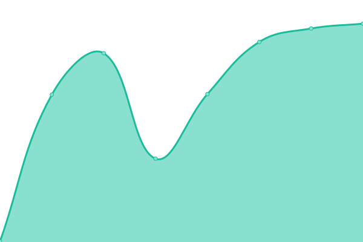

# [📈 Live Status](https://status.starlightgaming.network/): <!--live status--> **🟩 All systems operational**

This repository contains the open-source uptime monitor and status page for [Starlight Community Network](https://starlightgaming.network), powered by [Upptime](https://github.com/upptime/upptime).

With [Upptime](https://upptime.js.org), you can get your own unlimited and free uptime monitor and status page, powered entirely by a GitHub repository. We use [Issues](https://github.com/Starlight-Community-Network/Status.starlightgaming.network/issues) as incident reports, [Actions](https://github.com/Starlight-Community-Network/Status.starlightgaming.network/actions) as uptime monitors, and [Pages](https://https://status.starlightgaming.network/) for the status page.

<!--start: status pages-->
<!-- This summary is generated by Upptime (https://github.com/upptime/upptime) -->
<!-- Do not edit this manually, your changes will be overwritten -->
<!-- prettier-ignore -->
| URL | Status | History | Response Time | Uptime |
| --- | ------ | ------- | ------------- | ------ |
|  [Starlight Community Network](https://www.starlightcommunity.network) | 🟩 Up | [starlight-community-network.yml](https://github.com/Starlight-Community-Network/SCN-Status/commits/HEAD/history/starlight-community-network.yml) | 

 643ms
     
 | 

<a href="https://status.starlightcommunity.network/history/starlight-community-network">99.91%</a>
    

|  [Shimmering Community Docs](https://docs.starlightcommunity.network/Hub/Overview/) | 🟩 Up | [shimmering-community-docs.yml](https://github.com/Starlight-Community-Network/SCN-Status/commits/HEAD/history/shimmering-community-docs.yml) | 

 164ms
     
 | 

<a href="https://status.starlightcommunity.network/history/shimmering-community-docs">9.17%</a>
    

|  [Fallback Site](https://fallback.starlightcommunity.network) | 🟩 Up | [fallback-site.yml](https://github.com/Starlight-Community-Network/SCN-Status/commits/HEAD/history/fallback-site.yml) | 

 89ms
     
 | 

<a href="https://status.starlightcommunity.network/history/fallback-site">99.91%</a>
    

|  [Classic Site](https://classic.starlightcommunity.network) | 🟩 Up | [classic-site.yml](https://github.com/Starlight-Community-Network/SCN-Status/commits/HEAD/history/classic-site.yml) | 

 300ms
     
 | 

<a href="https://status.starlightcommunity.network/history/classic-site">99.92%</a>
    

|  [Clonn's SMP](smp.starlightcommunity.net) | 🟩 Up | [clonn-s-smp.yml](https://github.com/Starlight-Community-Network/SCN-Status/commits/HEAD/history/clonn-s-smp.yml) | 

 21ms
     
 | 

<a href="https://status.starlightcommunity.network/history/clonn-s-smp">100.00%</a>
    

|  [Photon Tweaks](https://photontweaks.starlightcommunity.net) | 🟩 Up | [photon-tweaks.yml](https://github.com/Starlight-Community-Network/SCN-Status/commits/HEAD/history/photon-tweaks.yml) | 

 338ms
     
 | 

<a href="https://status.starlightcommunity.network/history/photon-tweaks">99.92%</a>
    

|  [Roguenight Transportation CAD (Closed)](https://rntcad.starlightcommunity.net) | 🟩 Up | [roguenight-transportation-cad-closed.yml](https://github.com/Starlight-Community-Network/SCN-Status/commits/HEAD/history/roguenight-transportation-cad-closed.yml) | 

 330ms
     
 | 

<a href="https://status.starlightcommunity.network/history/roguenight-transportation-cad-closed">99.92%</a>
    

|  [Blossom Rabbit lounge](https://Blossom.starlightcommunity.net) | 🟩 Up | [blossom-rabbit-lounge.yml](https://github.com/Starlight-Community-Network/SCN-Status/commits/HEAD/history/blossom-rabbit-lounge.yml) | 

 301ms
     
 | 

<a href="https://status.starlightcommunity.network/history/blossom-rabbit-lounge">100.00%</a>
    

|  [BRCRP CAD (Kind of don't do nothing)](https://brcad.starlightcommunity.net) | 🟩 Up | [brcrp-cad-kind-of-don-t-do-nothing.yml](https://github.com/Starlight-Community-Network/SCN-Status/commits/HEAD/history/brcrp-cad-kind-of-don-t-do-nothing.yml) | 

 1147ms
     
 | 

<a href="https://status.starlightcommunity.network/history/brcrp-cad-kind-of-don-t-do-nothing">100.00%</a>
    

|  [BRCRP Server & Admin Panel (To return)](http://brcrp.starlightcommunity.net) | 🟩 Up | [brcrp-server-and-admin-panel-to-return.yml](https://github.com/Starlight-Community-Network/SCN-Status/commits/HEAD/history/brcrp-server-and-admin-panel-to-return.yml) | 

 0ms
     
 | 

<a href="https://status.starlightcommunity.network/history/brcrp-server-and-admin-panel-to-return">100.00%</a>
    

|  [FluffyxGaming (To Be Removed Visit URL Gor More Info)](http://fluffyx.starlightgaming.network) | 🟩 Up | [fluffyx-gaming-to-be-removed-visit-url-gor-more-info.yml](https://github.com/Starlight-Community-Network/SCN-Status/commits/HEAD/history/fluffyx-gaming-to-be-removed-visit-url-gor-more-info.yml) | 

 302ms
     
 | 

<a href="https://status.starlightcommunity.network/history/fluffyx-gaming-to-be-removed-visit-url-gor-more-info">100.00%</a>
    

|  [Collin3DModels](https://www.collin3dmodels.com/) | 🟩 Up | [collin3-d-models.yml](https://github.com/Starlight-Community-Network/SCN-Status/commits/HEAD/history/collin3-d-models.yml) | 

 394ms
     
 | 

<a href="https://status.starlightcommunity.network/history/collin3-d-models">100.00%</a>
    

<!--end: status pages-->

[**Visit our status website →**](https://status.starlightgaming.network/)

## 📄 License

- Powered by: [Upptime](https://github.com/upptime/upptime)
- Code: [MIT](./LICENSE) © [Anand Chowdhary](https://anandchowdhary.com), supported by [Pabio](https://pabio.com)
- Data in the `./history` directory: [Open Database License](https://opendatacommons.org/licenses/odbl/1-0/)
